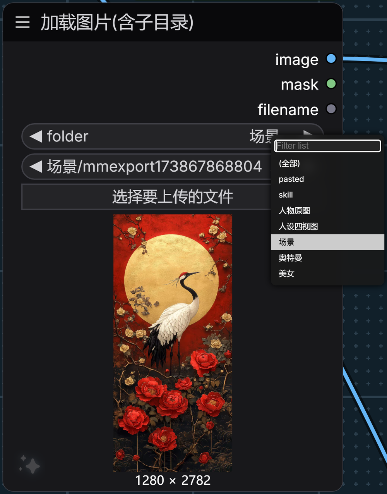

# Load Image (Recursive)

A drop-in replacement for ComfyUI's built-in **Load Image** node that also lists
images from **sub-directories** of `ComfyUI/input`, adds a **folder dropdown** to
filter the list, and — unlike anything else in the ecosystem — makes the
**thumbnails actually work** for those sub-directory files.

> 中文说明见 [下方](#中文说明)。



---

## The problem

The stock `Load Image` node only lists files sitting **directly** in
`ComfyUI/input`. Anything you filed into folders is invisible:

```
input/
├── 001.png              ← visible
├── portraits/
│   └── maya.png         ← invisible
└── scans/
    └── 2026/
        └── roll-01.tif  ← invisible
```

So you end up either dumping everything into one flat folder, or copying files
out of your library every single time.

There are already a few "load image from subfolder" nodes around. They solve the
listing problem and then hit a second wall: **the dropdown shows no thumbnail for
those images.** That's not their fault — it's a gap in ComfyUI's frontend, and
this node fixes it.

## What it does

1. **Recursive listing** — every image under `input/`, at any depth, with paths
   relative to `input` (`scans/2026/roll-01.tif`).
2. **Folder dropdown** — pick a folder and the image list narrows to just that
   folder. Turns a 1200-entry scroll into a 40-entry scroll.
3. **Working thumbnails** — sub-directory images show real thumbnails, and they
   are downscaled to 384 px before being sent, so opening the dropdown doesn't
   download a pile of 38 MB camera files.
4. **Bidirectional sync** — pick an image and the folder dropdown jumps to its
   folder; pick a folder and the list filters.

Everything else is inherited from the stock node, unchanged: decoding, EXIF
handling, alpha→mask, the upload button, drag & drop, paste, mask editor,
path-safety checks. Outputs are identical (`IMAGE`, `MASK`, `STRING`).

## Install

```bash
cd ComfyUI/custom_nodes
git clone https://github.com/yadoo7/load_image_recursive.git
```

Restart ComfyUI. No dependencies, no patch scripts, nothing to configure.

## Usage

Add **Load Image (Recursive)** from the `image` category (or search for
`recursive`, `subfolder`, `子目录`).

| Widget | What it does |
|---|---|
| `folder` | Filter only. `(全部)` / `(All)` shows everything. **Does not affect the output.** |
| `image` | The actual pick. Paths include the sub-folder, e.g. `scans/2026/roll-01.tif`. |
| *(upload button)* | Same as the stock node. Uploaded files land in the root of `input/`. |

Switching folders deliberately **does not** change your current image selection —
it only narrows the list. You re-pick explicitly. Nothing silently swaps your
input behind your back.

### Keeping the list fresh

`INPUT_TYPES` is only fetched when the node is created, so a list built then goes
stale as soon as you add a folder or drop a file into `input/`. Three paths
rebuild it, and they all go through the same authoritative `/object_info` call:

1. **Automatically** when ComfyUI rebuilds combo lists — via the official
   `refreshComboInNodes` extension hook. Without this the rebuild would wipe the
   folder filter, since ComfyUI assigns `options.values` wholesale.
2. **After using the upload button** (the value lands a moment later, so the
   rebuild is deferred).
3. **Manually**, right-click the node → **⟳ 刷新图片列表**.

Refreshing **keeps your folder selection** — it only rebuilds the lists. If the
folder you were on no longer exists, it falls back to `(全部)`.

## How the thumbnails work

Worth reading if you're curious why every other sub-folder loader has broken
thumbnails.

ComfyUI's frontend builds combo thumbnail URLs with an internal
`getMediaUrl(filename, type, kind)` helper, which emits:

```
/api/view?filename=<filename>&type=input
```

Two problems with that, for sub-folder-aware nodes:

* **No `subfolder`.** Our values are `scans/2026/roll-01.tif`, so the server
  resolves the basename against the `input` root, finds nothing, and returns
  **404**. No thumbnail.
* **No `max`.** Even when it does resolve, the server ships the **full-resolution
  original**. Fine for a 200 KB PNG, fatal for a 52 MP camera scan.

Both are fixable by editing `server.py` and the frontend bundle — but that means
patching ComfyUI core, which breaks on every update and can't be shipped as a
custom node.

So this node installs an **aiohttp middleware** instead, and fixes both on the
way in, before any handler sees the request. **Zero files outside
`custom_nodes/load_image_recursive/` are modified.**

The routing rule, in order:

| Request | Action |
|---|---|
| `channel=` present | MaskEditor needs real pixels → pass through, only inject `subfolder` |
| `max=` present | Frontend asked for a specific size → serve that thumbnail ourselves |
| `preview=` present | Canvas / image viewer → pass through, only inject `subfolder` |
| `filename` contains `/` | Bare dropdown request → serve a 384 px WebP ourselves |
| anything else | Untouched. Native ComfyUI behaviour. |

That fourth rule is the key one: **`filename` containing `/` is provably broken
natively** (it can only ever 404), so taking it over can't regress anything.
Requests that natively work are left alone.

Thumbnails are cached in-process, keyed on `(path, mtime, size, limit)`, so
re-opening the dropdown is free and editing a file invalidates its entry.

`/view` has supported `subfolder=` natively all along, with a directory-escape
check — the frontend just never used it.

## Optional: speed up the root folder too

The middleware only takes over requests that are broken natively. Images in the
**root** of `input/` resolve fine, so ComfyUI serves them at full resolution —
that's native behaviour, and this node leaves it alone.

If your `input/` root also holds big files and the dropdown feels slow, run:

```bash
python tools/patch_frontend_thumb.py            # patch
python tools/patch_frontend_thumb.py --check    # status only
python tools/patch_frontend_thumb.py --revert   # undo
```

It makes the frontend ask for `max=384` on combo thumbnails; the middleware then
honours it. This one **does** patch a file outside this folder
(`comfyui_frontend_package/static/assets/*.js`) and it is reverted by a frontend
update — hence optional, and with a `--revert`.

## Compatibility

* ComfyUI 0.39.x — tested against `0.39.1`.
* Needs `aiohttp` and `Pillow`, both already required by ComfyUI.
* If the middleware fails to install for any reason, the node still works — it
  logs a warning and thumbnails fall back to native behaviour. Node loading is
  never blocked.

## Development

```bash
python -m unittest discover -s tests -v
```

32 tests covering recursive scanning, directory-escape protection, thumbnail
downscaling and LRU eviction, the middleware routing table, and the
`VALIDATE_INPUTS` / `INPUT_TYPES` contract.

The suite works in two environments:

* **Inside ComfyUI** — uses the real `folder_paths` and `nodes`.
* **Bare environment** — detects that ComfyUI is missing and installs minimal
  stubs, so CI only needs `pip install aiohttp pillow` (no torch).

Both paths are verified to pass. `tests/test_load_image_recursive.py` picks
automatically.

Frontend behaviour (the folder filter and the three refresh paths) is not covered
by unit tests — it needs a live ComfyUI. Those were verified end-to-end with a
headless browser instead.

## Known limitations

* The `folder` widget is a front-end filter. It is not stored as a meaningful
  value and does not participate in caching, so switching folders never
  re-triggers a run.
* Folders are derived from the files inside them. An empty folder won't appear
  in the dropdown.
* `clipspace/` is skipped — that's MaskEditor scratch space, pure noise here.

## Credits

* Subclasses `LoadImage` from [ComfyUI](https://github.com/comfyanonymous/ComfyUI)
  by comfyanonymous. All decoding, masking and validation behaviour is theirs.
* The `folder` / `image` split is inspired by the folder-tree combos in
  [ComfyUI-Custom-Scripts](https://github.com/pythongosssss/ComfyUI-Custom-Scripts)
  by pythongosssss — a different implementation for a different problem, but the
  "pick the folder first" interaction comes from there.

## License

MIT — see [LICENSE](LICENSE).

Note that this is a plugin for ComfyUI, which is licensed under **GPL-3.0**. This
node imports and subclasses ComfyUI code at runtime; how that interacts with MIT
for a plugin is a judgment call you should make for your own use. Every custom
node in the ecosystem does the same thing.

---

## 中文说明

**「加载图片(含子目录)」** —— 原生 `加载图片` 的替代品，把 `ComfyUI/input` 下
**各级子目录**里的图片一起列进下拉，并多加一个「目录」下拉做过滤。

**解决什么**

原生节点只列 `input` 根目录里的文件。你按项目分好的文件夹（`人像/`、`扫描/2026/`）
它完全看不见，只能把所有图堆成一个平铺目录，或者每次从图库里往外拷。

**装上就有**

1. 递归扫描任意层级，路径相对 `input`（如 `扫描/2026/roll-01.tif`）
2. 「目录」下拉：选完目录，图片列表只列该目录下的文件
3. **缩略图真的能显示** —— 子目录图片的缩略图是好的，而且会先压到 384px 再发，
   打开下拉不会拉一堆几十 MB 的原图
4. 双向联动：选图 → 目录自动跳过去；选目录 → 列表收窄

解码、EXIF、alpha→mask、上传按钮、拖拽粘贴、遮罩编辑器、路径安全校验
全部继承原生实现，输出完全一致（`IMAGE` / `MASK` / `STRING`）。

**安装**

```bash
cd ComfyUI/custom_nodes
git clone https://github.com/yadoo7/load_image_recursive.git
```

重启 ComfyUI 即可。无依赖、无补丁脚本、无需配置。

**列表怎么保持最新**

`INPUT_TYPES` 只在建节点时取一次，所以之后往 `input/` 里新建文件夹、拖图进去，
下拉里都看不到。三条路径都会重建，而且都走同一个权威来源（`/object_info`）：

1. **自动** —— ComfyUI 重建 combo 列表时，通过官方扩展钩子 `refreshComboInNodes`。
   没有这个钩子的话，ComfyUI 会直接整体替换 `options.values`，把目录过滤冲掉
2. **上传后自动** —— 值要过一会儿才落下来，所以是延时重建
3. **手动** —— 右键节点 →「⟳ 刷新图片列表」

刷新**会保留你当前选的目录**，只重建列表；如果那个目录已经不存在了，才退回 `(全部)`。

**为什么别人的子目录加载器没有缩略图**

ComfyUI 前端的 combo 缩略图 URL 由内部函数 `getMediaUrl()` 生成，只拼
`filename` + `type`：**不带 `subfolder`，也不带 `max`**。于是子目录图片被服务端
当成根目录文件去找 → 404；根目录的大图则整张原图发下来。

这两点要么改 `server.py` + 前端打包产物（改核心，升级就冲突，没法作为
custom node 发布），要么在节点里挂一个 aiohttp middleware 在请求进入 handler
之前拦下来。本项目选后者：**`custom_nodes/load_image_recursive/` 以外的文件
一个都没改。**

分流规则见上表。关键判据是第四条 —— `filename` 里带 `/` 的请求在原生实现下
**必然 404**，接管它不可能让情况变差；原生能正常处理的请求一律不碰。

**可选：根目录大图也加速**

middleware 只接管原生必然失败的请求。`input` 根目录的图原生能正常解析，
所以还是按原尺寸发。如果你的根目录也有大文件、下拉觉得卡，跑
`tools/patch_frontend_thumb.py`（带 `--check` / `--revert`）。这一步会改到
`custom_nodes/` 以外的文件，所以标为可选。

**开发 / 测试**

```bash
python -m unittest discover -s tests -v
```

32 个测试，覆盖递归扫描、目录逃逸防护、缩略图降采样与 LRU 淘汰、
middleware 分流表、以及 `INPUT_TYPES` / `VALIDATE_INPUTS` 契约。
装了 ComfyUI 就用真模块，没装就自动装 stub（CI 里只要 `aiohttp` + `Pillow`，
不用拉 torch）。前端行为需要活的 ComfyUI，是用无头浏览器端到端验证的。

**注意**

* 「目录」只是前端过滤器，不参与出图，也不参与缓存判定（切目录不会触发重跑）
* 切目录**不会**自动改你已选的图 —— 需要重新选。这是故意的，不能悄悄换掉出图输入
* 空目录不会出现在下拉里（目录是从文件反推的）
* `clipspace/` 会被跳过（那是 MaskEditor 的临时目录）
